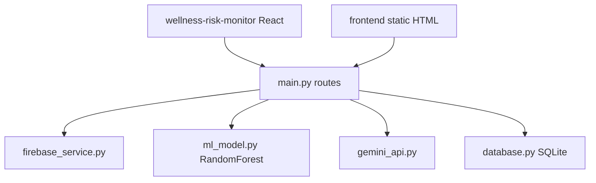

# AIOT HealthSphere — Wellness Risk Monitor

**Reads wearable vitals (heart rate, steps, calories) from Firebase, scores health risk with a Random Forest, and asks Gemini for a wellness tip.**

      

**AIOT HealthSphere** is a wellness monitor. Wearable data (Google Fit types for heart rate, step count and calories)
lands in a **Firebase Realtime Database**; a **FastAPI** backend reads it (`GET /data`), scores risk with a
**Random Forest** trained on public heart-failure and sleep-health datasets (`POST /predict`), asks **Google Gemini** for a
short recommendation, and logs each result to SQLite. Two frontends exist: a plain HTML/JS page (`frontend/`) and a
React + shadcn/ui dashboard (`wellness-risk-monitor/`, generated with Lovable) that refreshes every 20 seconds with
metric cards, a risk gauge and recommendations. `analysis/` holds the EDA notebook and model-comparison charts.

It is a learning project, **not a medical device**.

## Table of contents

1. [At a glance](#at-a-glance)
2. [Key features](#key-features)
3. [Tech stack](#tech-stack)
4. [Architecture in one picture](#architecture-in-one-picture)
5. [Repository structure](#repository-structure)
6. [Getting started](#getting-started)
7. [Configuration](#configuration)
8. [Available scripts](#available-scripts)
9. [Testing](#testing)
10. [Deployment](#deployment)
11. [Documentation](#documentation)
12. [Project status](#project-status)
13. [Contributing](#contributing)
14. [Security](#security)
15. [Licence](#licence)
16. [Contacts](#contacts)

## At a glance

|  |  |
|---|---|
| What it is | Reads wearable vitals (heart rate, steps, calories) from Firebase, scores health risk with a Random Forest, and asks Gemini for a wellness tip. |
| Who it is for |  |
| Status | Academic IoT/AI project (2025) |
| Primary language | Python (FastAPI) + TypeScript (React) |
| Hosting | Not deployed — runs locally |
| Repository | Public — `SwAsTiK6937/AIOT_HealthSphere` |
| Default branch | `main` |
| Commits / first / latest | 10 commits · 2025-04-01 → 2025-11-03 |
| Contributors | SwAsTiK6937 (6), JAYESH JAIN (2), LeVo011 (1), VanshRajput-dev (1) |
| Upstream | Team project by SwAsTiK6937, Jayesh Jain, LeVo011, VanshRajput-dev; Hirav Kadikar is a collaborator. |

## Key features

- **Vitals ingestion** — Reads users/<uid>/vitals from Firebase Realtime Database via firebase-admin
- **Risk model** — RandomForest (100 trees) on Age, RestingBP, Cholesterol, MaxHR, Steps, SleepHours; returns probability 0–1
- **AI recommendation** — Gemini generates a short fitness/wellness tip from the vitals and score
- **History log** — Each prediction saved to SQLite fitness_data.db
- **Dashboards** — Static HTML page and React dashboard (gauge, metric cards, recommendation card, 20 s refresh)
- **Analysis** — EDA notebook and charts comparing models

## Tech stack

| Layer | Technology | Why it is used |
|---|---|---|
| API | FastAPI, Uvicorn | Backend |
| ML | scikit-learn RandomForest, pandas, numpy | Risk score |
| AI | google-generativeai (gemini-2.0-flash) | Tips |
| Data | Firebase Admin, SQLite | Source and log |
| UI | React 18, Vite, shadcn/ui, Recharts | Dashboard |

## Architecture in one picture



Full detail: [docs/ARCHITECTURE.md](docs/ARCHITECTURE.md).

## Repository structure

```text
AIOT_HealthSphere/
├── backend/               # FastAPI, model, Firebase, Gemini, SQLite
├── wellness-risk-monitor/ # React dashboard (Lovable)
├── frontend/              # static HTML version
├── analysis/              # EDA notebook + charts
├── node_modules/          # committed by mistake (~4,900 files)
└── run_all.bat
```

## Getting started

### Prerequisites

- Python 3.10, Node 18
- Firebase service-account key (backend/serviceAccountKey.json)
- Gemini API key

### Install and run locally

```bash
git clone https://github.com/SwAsTiK6937/AIOT_HealthSphere.git
cd AIOT_HealthSphere/backend
pip install fastapi uvicorn pandas numpy scikit-learn firebase-admin google-generativeai
python main.py                     # http://localhost:8000
cd ../wellness-risk-monitor && npm install && npm run dev
```

## Configuration

No environment variables or secrets are required.

## Available scripts

_None recorded._

## Testing

No automated tests; model accuracy printed at training. See [docs/PROJECT.md](docs/PROJECT.md#quality-and-testing).

## Deployment

Not deployed. Step-by-step: [docs/RUNBOOK.md](docs/RUNBOOK.md).

## Documentation

Every document below is part of the project's controlled documentation set.

| Document | Audience | What it answers |
|---|---|---|
| [README](README.md) | Everyone | What is it, how do I run it, where is everything? |
| [Project Overview (in depth)](docs/PROJECT.md) | Everyone | Why it exists, every feature explained, timeline, quality, security, risks, glossary |
| [Product Requirements (PRD)](docs/PRD.md) | Product, business, engineering | What problem, for whom, what must it do, how is success measured? |
| [Architecture](docs/ARCHITECTURE.md) | Engineers, architects | How is it built, how does data flow, where does it run, why? |
| [Runbook](docs/RUNBOOK.md) | Engineers, operators | How do I set it up, configure, deploy, roll back and troubleshoot it? |
| [Session Handover](docs/SESSION_HANDOVER.md) | Next owner / next session | Where exactly did work stop and what is next? |

## Project status

A finished team project (last change Nov 2025). Works locally with the owner's Firebase and Gemini keys.

Latest hand-off notes: [docs/SESSION_HANDOVER.md](docs/SESSION_HANDOVER.md).

## Contributing

Branch from the default branch (`feat/…`, `fix/…`), use Conventional Commit messages, open a pull request, and update the docs in the same PR.

## Security

Please do not open public issues for vulnerabilities; contact the maintainer privately. Security design is covered in [docs/PROJECT.md](docs/PROJECT.md#security-and-privacy).

## Licence

No licence file is present, so all rights are reserved by the owner by default. Add a `LICENSE` file before accepting outside contributions or reuse.

## Contacts

| Role | Name | Contact |
|---|---|---|
| Repository owner | SwAsTiK6937 | [@SwAsTiK6937](https://github.com/SwAsTiK6937) |
| Collaborator | Hirav Kadikar | [@HiravK](https://github.com/HiravK) |
