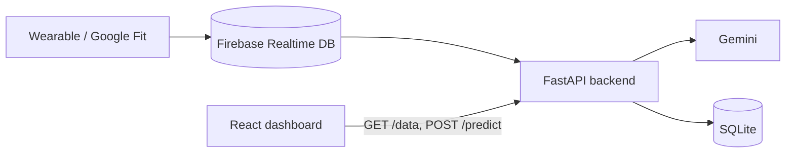
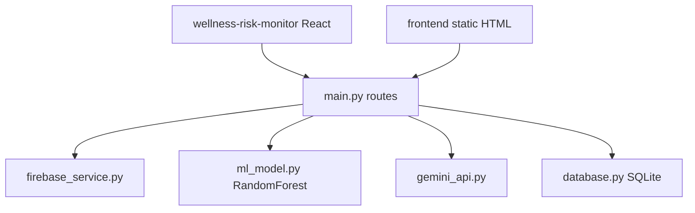

# Architecture Document — AIOT HealthSphere — Wellness Risk Monitor

| Field | Value |
|---|---|
| Document ID | AIOTHS-ARCH |
| Project | AIOT HealthSphere — Wellness Risk Monitor |
| Repository | [`SwAsTiK6937/AIOT_HealthSphere`](https://github.com/SwAsTiK6937/AIOT_HealthSphere) |
| Version | 1.0 |
| Status | Approved — living document |
| Owner | Hirav Kadikar |
| Classification | Public |
| Last updated | 2026-09-25 |

> **Purpose:** Explains how the system is built: its parts, how data moves, where it runs, and why it was built this way. Structured on the C4 model and arc42.

## 1. Revision history

| Version | Date | Author | Change |
|---|---|---|---|
| 1.0 | 2026-09-25 | Hirav Kadikar | Full documentation suite generated from a complete review of the repository. |

## 2. Introduction and goals

FastAPI (`backend/main.py`) wires three services: `firebase_service.fetch_health_data(uid)`, `ml_model.model`
(RandomForest trained at import from CSVs in backend/data), and `gemini_api.gemini`. `POST /predict` → score → Gemini tip →
SQLite insert → JSON. The React dashboard polls the API; the static frontend does the same with fetch.

### Quality goals (in priority order)

| Priority | Quality attribute | What it means here |
|---|---|---|
| 1 | Clarity | Simple score + one tip |
| 2 | Freshness | Near-live vitals |

## 3. Constraints

_None recorded._

## 4. System context (C4 level 1)

Who and what the system talks to.

| External actor / system | Interaction |
|---|---|
| Firebase Realtime Database | Vitals source |
| Google Gemini | Recommendations |
| scikit-learn, pandas | Model |
| Lovable | Generated the React dashboard |

## 5. Containers (C4 level 2)

## 6. Components (C4 level 3)

| Component | Location | Responsibility |
|---|---|---|
| API | `backend/main.py` | /data and /predict, CORS |
| Firebase | `backend/firebase_service.py` | Read vitals for a user |
| Model | `backend/ml_model.py, health_model.pkl, data/*.csv` | Train and predict |
| Gemini | `backend/gemini_api.py` | Recommendation text |
| Storage | `backend/database.py` | SQLite log |
| React dashboard | `wellness-risk-monitor/src` | Gauge, cards, polling |
| Static UI | `frontend/` | Login/signup/index pages |
| Analysis | `analysis/` | Notebook and charts |

## 7. Runtime view — key flows

_Single-step flows only; see components._

## 8. Data architecture

Vitals in Firebase under users/<uid>/vitals; predictions in SQLite table user_data (timestamp, heart_rate, steps,
sleep_hours, risk_score). Training data: heart_failure.csv and sleep_health.csv (public Kaggle datasets).

### Interfaces / API endpoints

| Method | Path | Auth | Purpose | Request → Response |
|---|---|---|---|---|
| GET | `/data` | None | Latest vitals from Firebase | — → vitals |
| POST | `/predict` | None | Risk + recommendation | {heartRate, steps, calories} → {risk_score, recommendation, …} |

## 9. Deployment view

Not deployed.

| Environment | Where | Notes |
|---|---|---|
| Local | API :8000 (main.py) or :8001 (run_all.bat); React via `npm run dev` | Needs serviceAccountKey.json |

## 10. Technology stack

| Layer | Technology | Why |
|---|---|---|
| API | FastAPI, Uvicorn | Backend |
| ML | scikit-learn RandomForest, pandas, numpy | Risk score |
| AI | google-generativeai (gemini-2.0-flash) | Tips |
| Data | Firebase Admin, SQLite | Source and log |
| UI | React 18, Vite, shadcn/ui, Recharts | Dashboard |

## 11. Cross-cutting concepts

## 12. Architecture decisions (ADR log)

### ADR-01: Random Forest on public datasets

|  |  |
|---|---|
| Status | Accepted |
| Date | 2025-04-20 |
| Context | No labelled wearable data available. |
| Decision | Train on heart-failure + sleep-health CSVs and fill unknown features with defaults. |
| Consequences | Working demo; Score is indicative only |
| Alternatives considered | — |

## 13. Quality scenarios

_None recorded._

## 14. Risks and technical debt

Full register in [PROJECT.md](PROJECT.md#risks-and-technical-debt). Top items:

- **Leaked keys abused** — Revoke keys
- **Score read as medical advice** — Disclaimer

## 15. Glossary

See [PROJECT.md](PROJECT.md#glossary).
